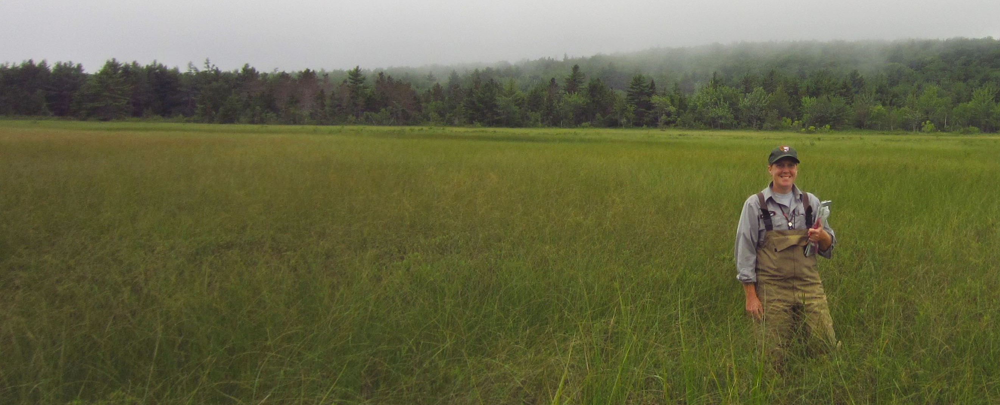

<h1><b>Kate Miller GitHub landing page</b></h1>

<h2>R training websites</h2>

<a href="https://katemmiller.github.io/IMD_R_Training_Intro/">IMD 2022 Scientists Training- Intro to R:</a> Developed Prep for Training and Visualizing Spatial Data. 
<a href="https://katemmiller.github.io/IMD_R_Training_Advanced/">IMD 2022 Scientists Training- Advanced R:</a> Developed Prep for Training, Data Retrieval, GIS in R, Downloading FIA data, R Markdown, and R Packages. 
<a href="https://katemmiller.github.io/R_Training/">ACAD R Training Fall 2020:</a> Intro to R training for Acadia NP Resource Management staff. 
<a href="https://katemmiller.github.io/Forest_Crew_R_Training">Forest Crew R Training 2020:</a> Intro to R training for NETN/MIDN forest crew. 

<h2>Github repos</h2>

Github profile: <a href="https://github.com/KateMMiller">KateMMiller</a> 
<a href="https://github.com/KateMMiller/forestMIDN">forestMIDN:</a> R package for summarizing and compiling MIDN forest data 
<a href="https://github.com/KateMMiller/forestNETN">forestNETN:</a> R package for summarizing and compiling NETN forest data 
<a href="https://github.com/KateMMiller/forestQAQC">forestQAQC:</a> QA/QC R markdown reports for weekly checks, QA/QC reports, and compiling previous visit data forms. 
<a href="https://github.com/KateMMiller/NETN_water_summaries">NETN_water_summaries:</a> R Markdown reports by park to summarize monthly water data relative to historic data. 
<a href="https://github.com/KateMMiller/wetlandACAD">wetlandACAD:</a> R package for summarizing and compiling freshwater wetland data in Acadia National Park 
<a href="https://github.com/KateMMiller/wetlandViz">wetlandViz:</a> R shiny app to visualize freshwater wetland data in Acadia National Park 
<a href="https://github.com/KateMMiller/forestTrends">forestTrends:</a> R package for non-parametric trend analysis with mixed models. Package includes non-parametric power simulations. 
<a href="https://github.com/KateMMiller/rockyIntertidal">rockyIntertidal:</a> R package for rocky intertidal data, including compiling temp. logger data relative to high tide and compiling, summarizing, and visualizing community data.  

<h2>Other websites/Information</h2>

<a href="./info/Kate_Miller_CV_2023.pdf">CV</a> 
<a href="https://scholar.google.com/citations?hl=en&user=RgRcsHoAAAAJ&view_op=list_works&sortby=pubdate">Google Scholar publications</a> 
<a href="https://www.researchgate.net/profile/Kathryn_Miller8">ResearchGate</a> 
<a href="https://katemmiller.shinyapps.io/NETN_FHM_photos/">NETN Forest Photopoint Viewer</a> 
<a href="https://katemmiller.shinyapps.io/MIDN_FVM_photos/">MIDN Forest Photopoint Viewer</a> 
<a href="https://katemmiller.shinyapps.io/wetlandviz/">ACAD Freshwater Wetland Visualizer</a> 
<a href="https://www.nps.gov/im/netn">Northeast Temperate Network homepage</a> 
<a href="https://www.nps.gov/im/midn">Mid-Atlantic Network homepage</a> 

